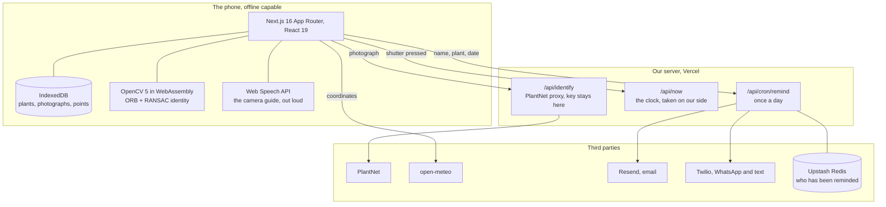

# RootedPlants.AI

**Everybody plants a tree. Nobody finds out what happened to it.**

You plant it, you take the photo, you post it. Then a year of small boring
jobs decides whether it lives, and nothing is holding you to them. Rooted
holds you to them, and pays you for it.

Spend money, earn points. Pay the credit card bill on time, earn more. Rooted
pays you for keeping something alive.

| | |
|---|---|
| **Live app** | [rootedplants.vercel.app](https://rootedplants.vercel.app) |
| **Demo video** | [4:54, in this repo](video/rooted-demo.mp4) |
| **Install it** | Open the live app on a phone and add it to the home screen. Android and iPhone, no store. |
| **Numbers** | Every figure below is in [`docs/evidence.md`](docs/evidence.md) with its source |

It is for the tulsi on the balcony and the money plant in the living room as
much as for the sapling from last month's drive. Same app, same schedule.

Built solo for [NextStep Hacks 2026](https://nextstep2026.devpost.com/), Earth
Forward track.

---

## Why

India's national auditor spent ten years on the Green India Mission across 15
states. About **5%** of a 2.8 million hectare planting target was achieved. At
roughly **70%** of the sites assessed, tree cover had not improved at all. At
one site, 2,000 plantings were reported, 30 to 40 saplings were found, and
none had lived.

One line explains the rest. **431 of 556 plantation journals did not record
the species planted, the coordinates, or the survival percentage.** Nobody was
ever asked to keep that record, so nobody kept it.

Meanwhile Indian companies spent **₹40,794 crore** on CSR in FY 2024-25 and
**₹3,397 crore** of it on environmental work, up 40% in a year. Above a ₹10
crore obligation the Companies Act already requires an independent assessment
of what the money achieved. The spending exists and the law already asks for
proof. The proof is what nobody can produce.

---

## How it works

**Register a plant once.** A photograph, the species, and the spot taken off
the device rather than typed. The photograph is checked before it is accepted:
point it at a notebook and it says there is no plant in it. Point it at a plant
and it works out what that plant is, from **seventy-eight species** searched by
the names people actually use, so "mogra" finds jasmine and "kadi patta" finds
curry leaf. Five profiles cover anything not on the list, because naming a
plant and knowing how to keep it alive are different jobs.

That first photograph becomes the baseline every later one is measured against,
and that spot is what every later check is measured against.

**The schedule follows your weather.** Each species carries a hand-written
care profile, and open-meteo then moves each watering by what the weather
actually did at that plant's coordinates. Rain pushes it out, a heat spell
pulls it in, and a pest check comes round sooner after warm wet days because
that is when pests turn up. The line under each task is that shift made
visible.

**The camera talks you through it.** The task says exactly what the photo has
to show before the camera opens. While it is open the app reads the live frame
a few times a second and says the one thing that would make this shot pass:
tilt down so the soil is in frame, hold still, too dark, that is it. Out loud,
because whoever is holding the phone is also holding a watering can. The ring
around the shutter turns green when there is nothing left to fix.

**Then it is checked.** Every photograph: it came off the camera rather than a
file picker, the time is taken on our side rather than read off the file, and
the location is within 120m of where the plant was registered.

**And it has to be that plant.** OpenCV finds keypoints in the new photograph
and in the plant's first one, matches them, and asks RANSAC whether the
survivors agree on a single viewpoint. The same plant returns several hundred
agreeing points. A different plant of the same species, in a similar pot,
returns about four. Measured live in the app: 485 against its own baseline, 4
against a different neem tree. It runs in the browser, on the phone, on a 256px
copy, and nothing is uploaded to do it.

Then a check for the task itself, and each one reports the number it measured.
Watering has to show soil at least 5% darker than that plant's dry baseline. A
pest photo has to be close and sharp enough that something the size of an aphid
would show.

**It reaches you, rather than waiting to be opened.** A plant cannot wait for
you to remember it, so when a task comes due the same message goes out on
WhatsApp, on email and as a text. A name, a plant and a date go to the server for that.
No photographs and no coordinates: those never leave the phone.

**Get paid for keeping it.** Points land when the photo clears, streaks
multiply, and losing a plant to something outside your control costs nothing.

Full detail: [`how it is verified`](docs/verification.md) ·
[`the reward economy`](docs/rewards.md) · [`every objection, answered`](docs/risks.md)

## Architecture

Phone first, and almost everything stays on the phone. The only thing that
reaches a server is what is needed to send a reminder.



**What never leaves the device:** photographs, baselines, coordinates, points
and history. The identity check runs in the browser on a 256 px copy, so the
one comparison that decides whether points are earned needs no upload and no
signal.

**What does leave:** the photograph goes to PlantNet once, at registration,
to answer what the plant is and whether it is a plant at all. Coordinates go
to open-meteo to move the schedule. A name, a plant and a date go to the cron
so it can send a reminder.

| File | What it decides |
|---|---|
| [`web/lib/store.ts`](web/lib/store.ts) | Everything on the device, and the health band |
| [`web/lib/verify.ts`](web/lib/verify.ts) | The five checks and their thresholds |
| [`web/lib/identity.ts`](web/lib/identity.ts) | Is this the same plant |
| [`web/lib/coach.ts`](web/lib/coach.ts) | What the camera says, and when |
| [`web/lib/notify.ts`](web/lib/notify.ts) | One message, every channel |
| [`web/lib/data.ts`](web/lib/data.ts) | 78 species, their care, their local names |
| [`video/build.py`](video/build.py) | The demo film, built from this repo |

## Every number the app shows, it measured

| Check | Threshold | Measured |
|---|---|---|
| Is it the same plant | 25 agreeing keypoints | **485** against its own baseline, **4** against a different neem in a similar pot |
| Did the watering happen | soil 5% darker | **28.4%** for a watered pot, **0.0%** for the same frame against itself |
| Is it a plant at all | 3% PlantNet confidence | **0.2%** an object, **0.5%** a wall, **9%** the weakest real plant |
| Is it here | within 120 m | read off the device, never typed |
| Did it come off the camera | live stream only | a file picker is reported as one |

Three earlier versions were replaced because the number was bad, and that is
written up in [`progress.md`](progress.md). An on-device colour and texture
classifier scored **0 out of 17** against 8% for guessing. Greenness as a
plant test turned out useless, because real plants run from 0% to 97% green.
The framing check used to include the soil, so watering the plant properly
darkened the soil, dropped the score, and failed the check because the
watering had worked.

## Running it

```bash
cd web
npm install
npm run dev
```

Then open the address it prints. Nothing else is needed: the weather API takes
no key and there is no environment file to fill in.

| Route | What it is |
|---|---|
| `/` | The landing |
| `/join` | Sign up, or the demo account in one tap |
| `/today` | What is due now, and why now |
| `/do/[task]` | The brief, the camera, and the checks |
| `/plants` | Everything in your care, with its health |
| `/plants/[id]` | One plant's record: photo history, streak, loss report |
| `/plants/new` | Register a plant |
| `/rewards` | Balance, catalogue, redemption |
| `/me` | Account and the reminder channels |
| `/how-it-works`, `/privacy`, `/accessibility` | Written for somebody who wants to read rather than click |

The Today screen carries a **+3 days** control. A watering due on Saturday
cannot be shown in a five minute video, so the demo moves the day instead of
waiting for it.

**Open [the live site](https://rootedplants.vercel.app) on a phone** if you want the camera and the
location checks. Both are browser features that only work on a secure origin, so on
`localhost` over plain HTTP the camera falls back to the file picker and the
verification card says plainly that the photograph did not come from the
camera.

### Where the data lives

Plants, photographs and the points ledger are held in IndexedDB on the device,
behind one module (`web/lib/store.ts`). The photographs never leave the phone,
the app works with no signal, and there is no account to lose. Accounts
themselves are a cookie: a name, an email and the mobile number the reminders
go to.

The first time the app loads it seeds a demo account with six plants, four
months of ledger and a photo history each, standing a few metres from wherever
the device is. So the first screen is a working account rather than an empty
room, and the location check passes on the first task wherever you open it.

## Not built yet, on purpose

This is a hackathon build with a deadline, so the time went where it changes
whether the idea works and whether it matters. These are designed and
deliberately not wired:

**Sign in with Google, and passwords.** Making an account works: give a name,
an email and a mobile number, and you are through. The number is required,
because it is the channel the reminders arrive on rather than a field a form
usually has. The account lives in a cookie on that device, so it survives
reloads and restarts and can be signed out, and there is no password to lose
and no store of other people's credentials to protect.

What that costs is that an account lives on one device. Moving to another
means filling the form again. An identity provider and a user table fix that
and change nothing else about whether the idea works, so they are a later
problem.

**Reminders, on this deployment.** The senders are written and wired: one
message composed once in `web/lib/notify.ts`, sent through Resend for email
and Twilio for WhatsApp and text, fired by a Vercel cron once a day. Each
channel switches on its own and a missing key costs you that channel rather
than the whole reminder, which is what the account screen reports. This
deployment carries no keys, so it reaches no channels until they are set:
`RESEND_API_KEY`, `TWILIO_ACCOUNT_SID`, `TWILIO_AUTH_TOKEN`,
`TWILIO_WHATSAPP_FROM`, `KV_REST_API_URL` and `KV_REST_API_TOKEN`. Names are
in `web/.env.example`.

**A server-side database.** IndexedDB is the right shape for a phone-first app
whose photographs should not leave the device, and it is genuinely what runs.
A server copy is what an organisation would need to see what its drive
produced, and that is the first thing Postgres is for.

**The rewards catalogue is seeded with demo partners.** Generic names, no real
brands. That is what a catalogue looks like before partners sign.

## Repository

| | |
|---|---|
| [`project.md`](project.md) | What is being built, and the rules it has to satisfy |
| [`state.md`](state.md) | What is running today, what is decided, what is still open |
| [`progress.md`](progress.md) | Dated log, including what broke and why |
| [`docs/design.md`](docs/design.md) | The look, screen by screen, and the rules behind it |
| [`docs/video.md`](docs/video.md) | The demo, shot by shot |
| [`video/cards.html`](video/cards.html) | The title cards the video is cut from, in the app's own tokens |
| [`docs/testing.md`](docs/testing.md) | Every feature, and how to check it yourself |
| [`docs/verification.md`](docs/verification.md) | How a care task is proved, and what is deliberately not attempted |
| [`docs/rewards.md`](docs/rewards.md) | Points, streaks, and where the money comes from |
| [`docs/risks.md`](docs/risks.md) | Every objection, with its answer |
| [`web/`](web) | The app |
| [`tools/`](tools) | Scripts that fetched and vetted the media, and that build the species table |
| [`video/`](video) | The demo film, and everything that builds it |
| [`docs/evidence.md`](docs/evidence.md) | Every number the pitch uses, and where it came from |

## Media

Every photograph, clip and recording here is CC0, public domain, or under the
Pexels licence, so none of it carries an attribution condition. Provenance is
recorded in `sources.json` beside each set, under `web/public/`: `video/`,
`forest/`, `plants/`, `baselines/`, `people/` and `audio/`.

Search alone was not enough to find them. A query for "misty forest" returned
a foggy city street with Christmas lights, and one for "money plant" returned
a Bitcoin buried in a pot. `tools/forest_candidates.py` and
`tools/fetch_baselines.py` pull candidates and lay them out as one contact
sheet, so everything gets looked at before it ships. Four of twenty forest
clips were usable.

## Build window

Everything here was written during the hackathon period, Aug 21 to Sep 20,
2026. The commit history is the record. Anything carried in from earlier work
is disclosed in [`state.md`](state.md) under "Prior art carried in", which
currently lists nothing.
